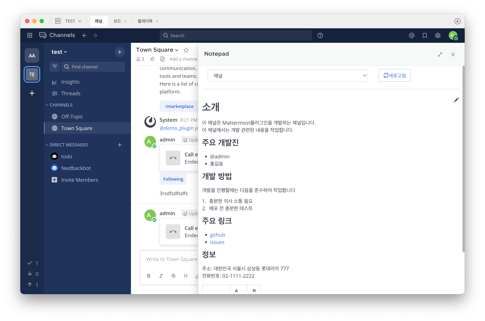
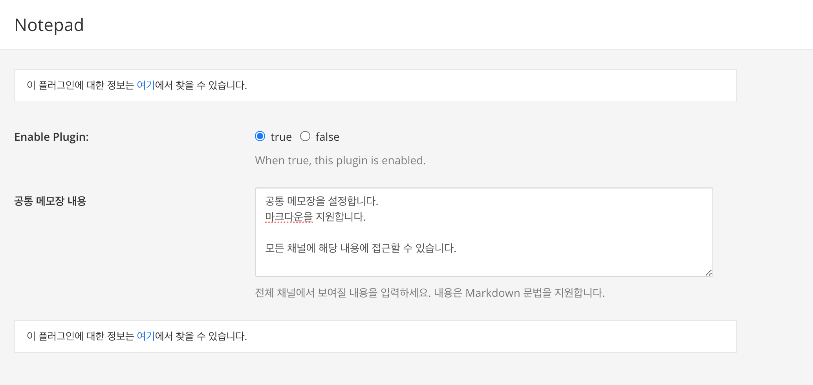
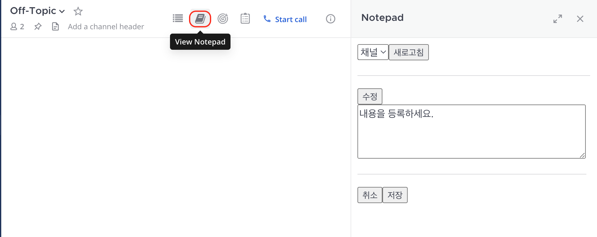

# Mattermost Notepad Plugin

Mattermost 채널에 메모장을 추가합니다.

Add a notepad to the Mattermost channel.



**주요기능:**

- 채널 메모장 : 각 채널마다 채널에 맞는 정보를 추가합니다.
- 공통 메모장 : 전체 채널에서 보여지는 메모장으로 플러그인 설정에서 설정합니다.

## install

플러그인을 사용하기 위해서 다음과 같이 작업합니다.

1. Go the releases page and download the [latest release](https://github.com/oming/mattermost-plugin-notepad/releases).
2. On your Mattermost, go to System Console -> Plugin Management and upload it.
3. Configure plugin settings as desired.
4. Start using the plugin!


## Usage

### Common Notepad 설정

전체 채널에서 사용할 정보를 추가/수정 합니다.

**System Console > Plugins > Notepad** 로 이동합니다.

공통 메모장 내용을 입력합니다.



여기에 설정된 내용은 채널의 우측 패널에서 정보가 표시됩니다.

채널의 Notepad를 열고 드롭다운을 클릭하여 공통을 선택합니다.


### Channel Notepad 설정

채널에서 사용할 정보를 추가/수정 합니다.

채널 상단의 Notepad 아이콘을 클릭합니다.

수정 버튼을 클릭후 내용을 수정합니다. 내용의 경우 Markdown 문법을 지원합니다.

모든 수정이 완료되면 저장을 클릭합니다.




### Slash Commands

슬래시 명령어를 통해 현재 설정된 메모장을 확인 할 수 있습니다. 슬래시 명령어의 경우 보기만 지원합니다.

**공통 메모장 보기**

```
/notepad common 
```

**채널 메모장 보기**

```
/notepad channel 
```

